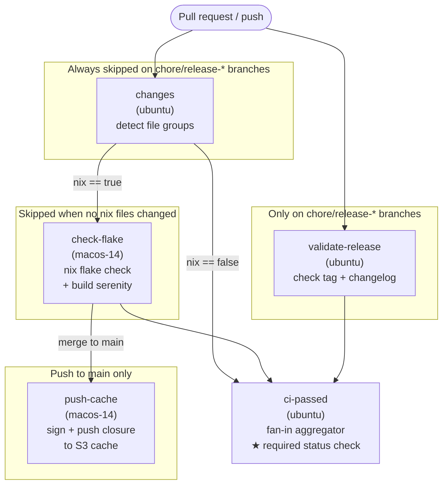

# CI job graph

`ci-passed` is the single required branch-protection status check. Skipped jobs count as passing, so a docs-only PR is never blocked waiting for `check-flake` to run.

See [`.github/workflows/ci.yml`](../.github/workflows/ci.yml) for the full workflow definition.
